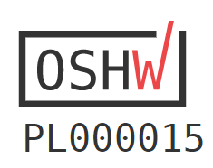

# PCIe x4 - x16
PCIe x4 - x16 adapter

## Description

TBD

## License

Project published as Open Source Hardware (OSHW) under CERN OHL v1.2 (Open Hardware License).

Project has been certified as Open Source Hardware by the Open Source Hardware Association (OSHWA).

UID: PL000015

https://certification.oshwa.org/pl000015.html

## Photos

